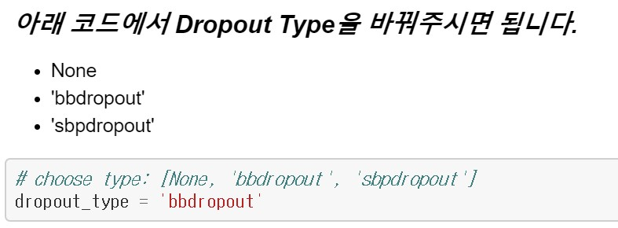

# Assignment (황성주 교수님 연구실)

실습 일시: 2019년 7월 24일(수), 14:00 - 17:30

담당 조교: 신우현 (wuhyun.shin@kasit.ac.kr), 이하연 (hayeon926@kaist.ac.kr)

## 개요
* **과제 A.** 전반부에 진행했던 내용(신우현 조교)은 Quiz 문제에 대한 답을 제출 
* **과제 B.** 후반부에 진행했던 내용(이하연 조교)은 제공된 코드를 기반으로 실행 결과 제출

## 공지사항

* 편하신 텍스트 에디터로 작업하신 후 PDF로 변환하여 제출하여 주시면 됩니다.
* 과제 A, B의 해당  순서대로 정렬해주시기 바랍니다.
* 각 파트 세부사항을 참조해주세요. 
* 과제 A, B 각각 5점씩 총 10점 만점으로 평가합니다.
* 제출기한은 7월 31일 (수) 19시입니다. wuhyun.shin@kaist.ac.kr로 제출해주세요.

## 과제 A 

다음 문제에 답하세요.

	1. SGVB에서 Reparametrization trick을 쓰는 이유는?
	
	2. Sparse VD에서 Local reparameterization Trick을 사용하는 이유는?
	
	3. Sparse VD에서 weight의 sparsity가 유도되는 이유는?
	
	4. Variational dropout의 prior가 log uniform인 이유는?

### 제출형식 및 배점
* 자유 양식으로 서술하되, 문제를 쓰고 그 아래에 답을 기재
* (1-4번) 1점씩, (5번) 2점 

## 과제 B

* 아래 세가지 타입의 (Non) Dropout 대한 코드가 과제에 첨부되어 있습니다.
	* Dropout을 사용하지 않는 경우
	* Beta-Bernoulli Dropout (BBD)
	* Structured Bayesian Pruning via Log-Normal Multiplicative Noise (SBPD)
* 위의 세 가지 실험에 대한 코드를 실행한 결과를 제출하세요.
	* 힌트: 코드의 다음 부분을 참조하여 dropout_type 변수를 변경하시면 됩니다. 

	

### 제출형식 및 배점

* 아래 내용을 보고서 형식으로 작성하여 제출해주세요.
	* 타입 변경 한 뒤의 dropout_type 변수와 그때의 training log의 일부분을 캡쳐하여 보고서에 첨부해주세요. (1점)
	* BBD와 SBPD 레이어의 sparsity를 시각화한 그림을 보고서에 첨부해주세요. (2점)
	* 위 3가지 타입의 (Non) Dropout에 대해 아래 표를 완성하여 보고서에 첨부하세요. (2점)
		* MNIST데이터 셋에 대한 TEST정확도.
		* Lenet-FC (실습에서 사용한 네트워크와 동일한 네트워크)의 활성화된 뉴런의 비율을 조사.
		* BBD와 SBPD의 레이어의 sparsity를 시각화.

| Model | Test Acc(%) | Layer 1 Memory (%) | Layer 2 Memory (%) | Layer 3 Memory (%) |
|-------|-------------|--------------------|--------------------|--------------------|
| None  |             | 100%               | 100%               | 100%               |
| BBD   |             |                    |                    |                    |
| SBPD  |             |                    |                    |                    |

